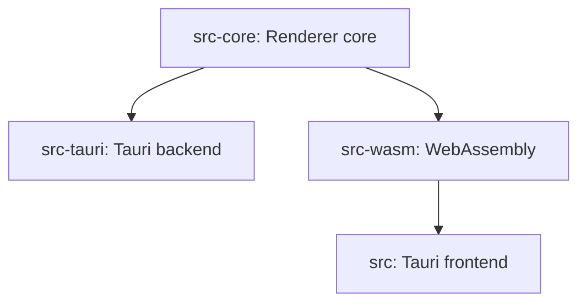

# Contributing

Thank you for considering contributing to this project! We welcome your contributions even small ones (like fixing typos).

## Prerequisites

- [Rust, Node.js and Tauri's dependencies](https://v2.tauri.app/ja/start/prerequisites/)
- [pnpm](https://pnpm.io/installation)
- [FFmpeg libraries](https://github.com/zmwangx/rust-ffmpeg/wiki/Notes-on-building)
- [wasm-pack](https://rustwasm.github.io/wasm-pack/installer/)
- [watchexec](https://github.com/watchexec/watchexec)

## Project structure
```
.
├── src
│    Tauri frontend
├── src-core:
│    Renderer core
├── src-tauri:
│    Tauri backend
└── src-wasm:
      WebAssembly
```


## Pull requests

- If you want to add a new feature, please create an issue first.
- Pull requests are squashed and merged, so you may need to create a new branch for each pull request.
- Please send a pull request to the `main` branch.
- Please include `\n` at the end of each file. (not required for generated files)
- Please follow the title format:
  ```
  type: Description
  ```
  - Types:
    - `feat`: New features
    - `enhance`: Enhancements
    - `fix`: Bug fixes
    - `change`: Other breaking changes
    - `refactor`: Code refactoring
    - `chore`: Maintenance tasks
    - `docs`: Documentation changes
- Please follow the branch format:
  ```
  type/description
  ```
- Don't worry about commit messages. They will be squashed! You only live once.
- If conflicts arise, please merge the `main` branch into your branch and resolve the conflicts.
